<h2>TensorFlow-FlexUNet-Image-Segmentation-ISPY1-Breast-Cancer (Updated: 2026/06/05)</h2>
Sarah T. Arai 
Software Laboratory antillia.com  
This is the first experiment of Image Segmentation for <b>ISPY1-Breast-Cancer (Benign and Malignant)</b> based on 
our <a href="./src/TensorFlowFlexUNet.py">TensorFlowFlexUNet</a>
 (<b>TensorFlow Flexible UNet Image Segmentation Model for Multiclass</b>), and a 512x512 pixels PNG
 <a href="https://drive.google.com/file/d/1oD72k5Me2mt-XQGFnVwxYsY9byq_jdcO/view?usp=sharing">
ISPY1-Breast-Cancer-ImageMask-Dataset.zip</a> (<a href="https://creativecommons.org/licenses/by/3.0/">CC BY 3.0</a>), which was derived by us from   
<a href="https://wiki.cancerimagingarchive.net/pages/viewpage.action?pageId=101942541#101942541215b684587f64c8cab1ffc45cd63f339">
<b>Expert tumor annotations and radiomic features for the ISPY1/ACRIN 6657 trial data collection (ISPY1-Tumor-SEG-Radiomics)
</b></a>.
  

<b>Actual Image Segmentation for ISPY1-Breast-Cancer Images of 512x512 pixels</b> 
As shown below, the inferred masks predicted by our segmentation model trained by the dataset appear similar to 
the ground truth masks.
  
<b>class-color-map = {Cancer:dark red}</b>
  
<table>
<tr>
<th>Input: image</th>
<th>Mask (ground_truth)</th>
<th>Prediction: inferred_mask</th>
</tr>
<tr>
<td>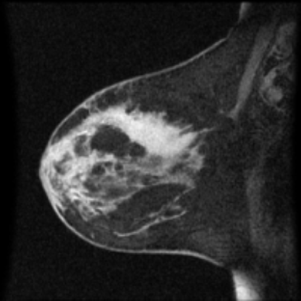</td>
<td></td>
<td></td>
</tr>

<tr>
<td>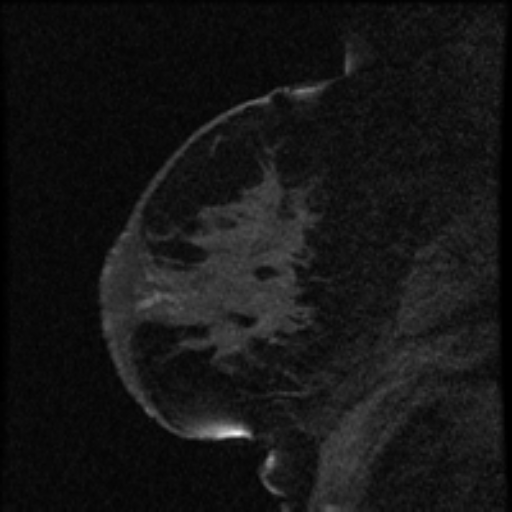</td>
<td></td>
<td></td>
</tr>

<tr>
<td>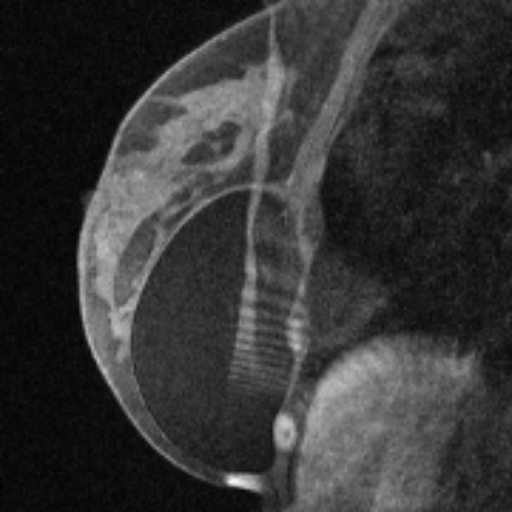</td>
<td></td>
<td></td>
</tr>
</table>

 
<h3>1. Dataset Citation</h3>
The dataset used here was derived from   
<a href="https://wiki.cancerimagingarchive.net/pages/viewpage.action?pageId=101942541#101942541215b684587f64c8cab1ffc45cd63f339">
<b>Expert tumor annotations and radiomic features for the ISPY1/ACRIN 6657 trial data collection (ISPY1-Tumor-SEG-Radiomics)
</b></a>.
 
 
The following explanation was taken from the above web site.  
<b>Summary</b> 
This dataset enhances the ISPY1 data collection, with uniformly curated data, tumor annotations, and 
quantitative imaging features. This dataset includes  
a) uniformly processed scans that are harmonized 
to match the intensity and spatial characteristics, facilitating immediate use in computational studies, 
b) computationally-generated and manually-revised expert annotations of tumor regions, as well as  
c) a comprehensive set of quantitative imaging (also known as radiomic) features corresponding to the tumor regions.
  
The segmentations for the ISPY1/ACRIN 6657 dataset currently hosted on TCIA’s website describe  
a) the tumor volume of interest (VOI) and  
b) functional tumor volume (FTV).
 
<ul>
<li>
1.The provided tumor VOI is a 3D rectangular box enclosing the enhancing tumor region, while including peritumoral tissue.
 The VOI provides a general guideline of where the tumor is located within patient anatomy, 
 but it does not delineate tumor boundaries or shape.
</li>
<li>
2.The FTV segmentations describe only enhancing voxels in the tumor, i.e., defined by peak enhancement or signal 
enhancement ratio criteria.</li>
</ul>
These currently provided segmentations do not include non-enhancing portions of the tumor volume, 
which represent a significant portion of the disease burden that needs to be studied to better 
understand and quantify the disease.
  
The segmentations in these new analysis results are for the entire 3D primary lesion, including both the 
enhancing and the non-enhancing tumor regions, therefore defining the structural tumor volume (STV).  
These STV annotations were generated by manually delineating the primary lesion volume, after confirming 
the location of the primary lesion from the provided VOI and FTV. 
The STV annotations were reviewed and approved by a board-certified, fellowship-trained breast radiologist, 
and are statistically significantly different from FTV.
  
We believe these STV annotations will allow analyses of the entire disease burden and analyses of tumor 
heterogeneity regarding contrast uptake, contributing to further expanding our mechanistic understanding 
of the disease potentially leading to improved patient management.
  
<b>Acknowledgements</b> 
Research reported in this publication was partly supported by the National Cancer Institute (NCI) 
of the National Institutes of Health (NIH), 
under award numbers U01CA242871 and U24CA189523, U01CA151235, R01CA197000, and R01CA132870.
 
 
<b>Data Citation</b> 
Chitalia, R., Pati, S., Bhalerao, M., Thakur, S., Jahani, N., Belenky, J. V., McDonald, E.S., Gibbs, J., Newitt, D., 
 Hylton, N., Kontos, D., & Bakas, S. (2021). 
<b>Expert tumor annotations and radiomic features for the ISPY1/ACRIN 6657 trial data collection [Data set].</b>  
The Cancer Imaging Archive. https://doi.org/10.7937/TCIA.XC7A-QT20
 
 
<b>License</b> 
<a href="https://creativecommons.org/licenses/by/3.0/">CC BY 3.0</a>
 
 
<h3>
2 ISPY1-Breast-Cancer ImageMask Dataset
</h3>
<h3>2.1 ISPY1-Breast-Cancer ImageMask Dataset</h3>
 If you would like to train this ISPY1-Breast-Cancer Segmentation model by yourself,
 please download the dataset from the google drive  
 <a href="https://drive.google.com/file/d/1oD72k5Me2mt-XQGFnVwxYsY9byq_jdcO/view?usp=sharing">
ISPY1-Breast-Cancer-ImageMask-Dataset.zip</a> <a href="https://creativecommons.org/licenses/by/3.0/">CC BY 3.0</a>
, expand the downloaded ImageMaskDataset and put it under <b>./dataset</b> folder to be
 
<pre>
./dataset
└─ISPY1-Breast-Cancer
    ├─test
    │   ├─images
    │   └─masks
    ├─train
    │   ├─images
    │   └─masks
    └─valid
         ├─images
         └─masks
</pre>
 
<b>ISPY1-Breast-Cancer Statistics</b> 
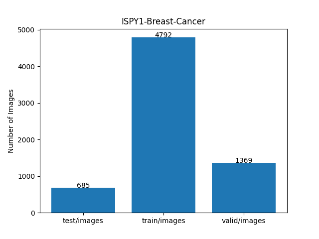 
 
As shown above, the number of images of train and valid datasets is large enough to use for the
 training set of our segmentation model.
 
 
<h3>2.2 Derivation of ISPY1-Breast-Cancer ImageMask Dataset</h3>
The folder of the original <b>ISPY1-Breast-Cancer BC</b> dataset is the following. 
<pre>
./ISPY1-Tumor-SEG-Radiomics
    └─NIfTI-Files
        ├─images_bias-corrected_nifti
        │  ├─ISPY1_1002
...
        │  └─ISPY1_1239
        ├─images_bias-corrected_resampled_zscored_nifti
        │  ├─ISPY1_1002
...
        │  └─ISPY1_1239
        ├─masks_ftv
        ├─masks_stv_manual
        └─masks_stv_resunet
</pre>
We generated a master dataset from all pairs of image slices of 3D volume <b>ISPY1_*.nii.gz</b> in 
<b>images_bias-corrected_resampled_zscored_nifti/ISPY1_*/</b> folder  and their corresponding 
mask slices of 3D volume <b>ISPY1_*.nii.gz</b> in <b>masks_stv_manual</b> folder. 
However, for simplicity, we excluded all empty black mask and their corresponding image slices of the NIfTI volumes, 
because they were irrelevant to train our segmentation model.
  
<h3>2.3 Train Sample Images and Masks</h3>

<b>Train sample images</b> 
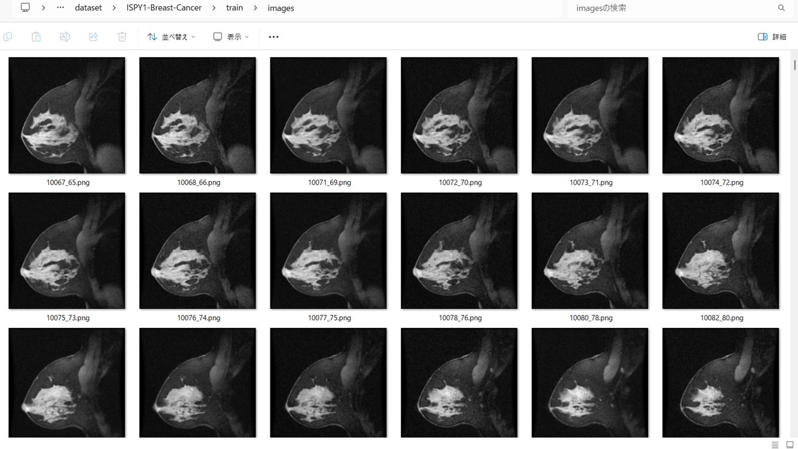
 
<b>Train sample masks</b> 
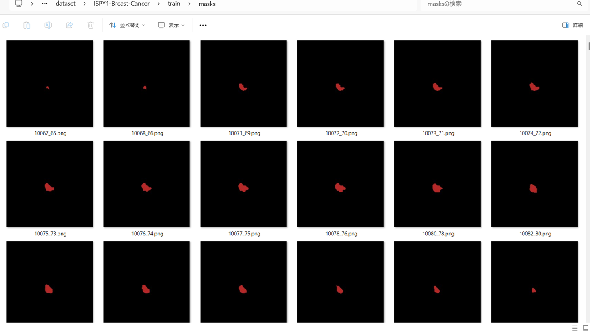
 
<h3>
3 Train TensorFlowFlexUNet Model
</h3>
 We trained ISPY1-Breast-Cancer TensorFlowFlexUNet Model by using the 
<a href="./projects/TensorFlowFlexUNet/ISPY1-Breast-Cancer/train_eval_infer.config"> <b>train_eval_infer.config</b></a> file.  
Please move to ./projects/TensorFlowFlexUNet/ISPY1-Breast-Cancer and run the following bat file. 
<pre>
>1.train.bat
</pre>
, which simply runs the following command. 
<pre>
>python ../../../src/TensorFlowFlexUNetTrainer.py ./train_eval_infer.config
</pre>

<b>Model parameters</b> 
Defined a small <b>base_filters = 16 </b> and large <b>base_kernels = (11,11)</b> for the first Conv Layer of Encoder Block of 
<a href="./src/TensorFlowFlexUNet.py">TensorFlowFlexUNet.py</a> 
and a large <b>num_layers = 8</b> (including a bridge between Encoder and Decoder Blocks).
<pre>
[model]
;You may specify your own UNet class derived from our TensorFlowFlexModel
model         = "TensorFlowFlexUNet"
image_width    = 512
image_height   = 512
image_channels = 3
input_normalize = True
normalization  = False
num_classes    = 2
base_filters   = 16
base_kernels   = (11,11)
num_layers     = 8
dropout_rate   = 0.05
dilation       = (1,1)
</pre>
<b>Learning rate</b> 
Defined a small learning rate.  
<pre>
[model]
learning_rate  = 0.00007
</pre>
<b>Loss and metrics functions</b> 
Specified "categorical_crossentropy" and <a href="./src/dice_coef_multiclass.py">"dice_coef_multiclass"</a>. 
<pre>
[model]
loss           = "categorical_crossentropy"
metrics        = ["dice_coef_multiclass"]
</pre>
<b>Dataset class</b> 
Specifed <a href="./src/ImageCategorizedMaskDataset.py">ImageCategorizedMaskDataset</a> class. 
<pre>
[dataset]
class_name    = "ImageCategorizedMaskDataset"
</pre>
 
<b>Learning rate reducer callback</b> 
Enabled learing_rate_reducer callback, and a small reducer_patience.
<pre> 
[train]
learning_rate_reducer = True
reducer_factor     = 0.4
reducer_patience   = 4
</pre>
<b>Early stopping callback</b> 
Enabled early stopping callback with patience parameter.
<pre>
[train]
patience      = 10
</pre>
<b>RGB Color map</b> 
Specifed rgb color map dict for ISPY1-Breast-Cancer 1+2 classes. 
<pre>
[mask]
mask_datatyoe    = "categorized"
mask_file_format = ".png"
;ISPY1-Breast-Cancer rgb color map dict for 1+1 classes.
;                     Cancer:dark red
rgb_map = {(0,0,0):0, (180,40,40):1 }
</pre>
<b>Epoch change inference callback</b> 
Enabled <a href="./src/EpochChangeInferencer.py">epoch_change_infer callback</a></b>. 
<pre>
[train]
epoch_change_infer       = True
epoch_change_infer_dir   =  "./epoch_change_infer"
num_infer_images         = 6
</pre>
By using this callback, on every epoch_change, the inference procedure can be called
 for 6 images in <b>mini_test</b> folder. This will help you confirm how the predicted mask changes 
 at each epoch during your training process.  
  
As shown below, early in the model training, the predicted masks from our UNet segmentation model showed 
discouraging results.
 However, as training progressed through the epochs, the predictions gradually improved. 
   
 
<b>Epoch_change_inference output at starting (epoch 1,2,3)</b> 
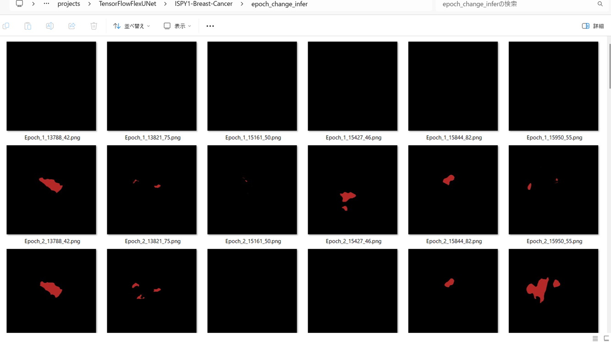 
 
<b>Epoch_change_inference output at middlepoint (epoch 13,14,15)</b> 
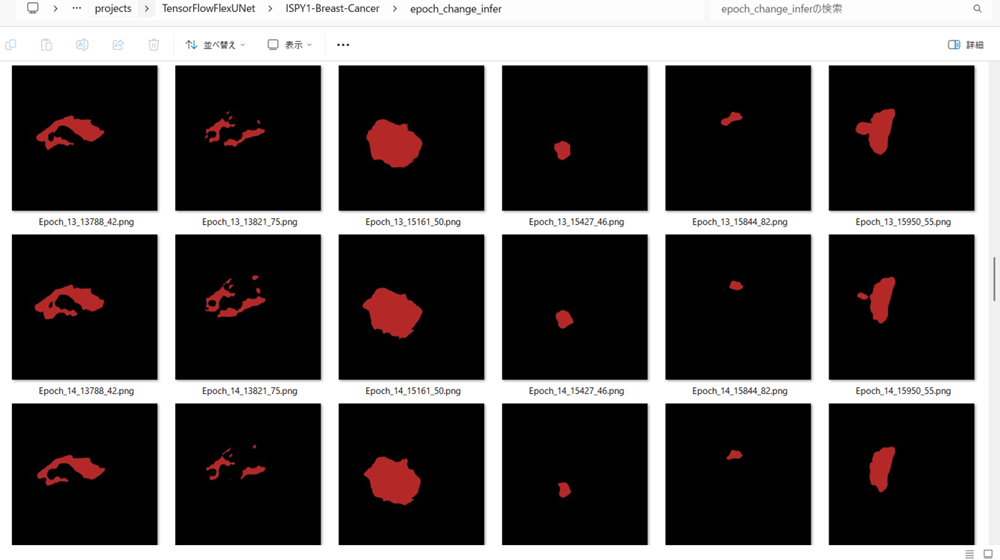 
 

<b>Epoch_change_inference output at ending (epoch 28,29,30)</b> 
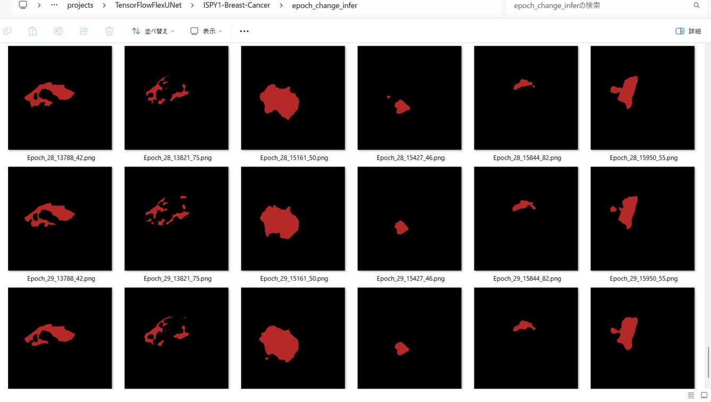 
 

In this experiment, the training process was terminated at epoch 30.  
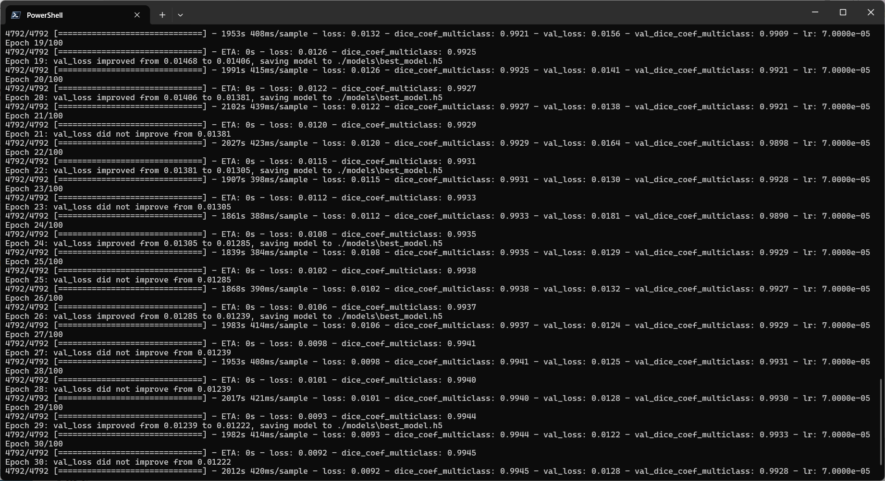 
 

<a href="./projects/TensorFlowFlexUNet/ISPY1-Breast-Cancer/eval/train_metrics.csv">train_metrics.csv</a> 
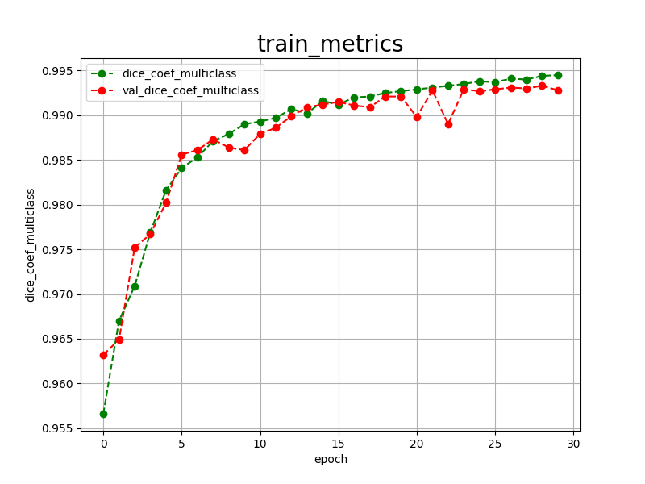 

 
<a href="./projects/TensorFlowFlexUNet/ISPY1-Breast-Cancer/eval/train_losses.csv">train_losses.csv</a> 
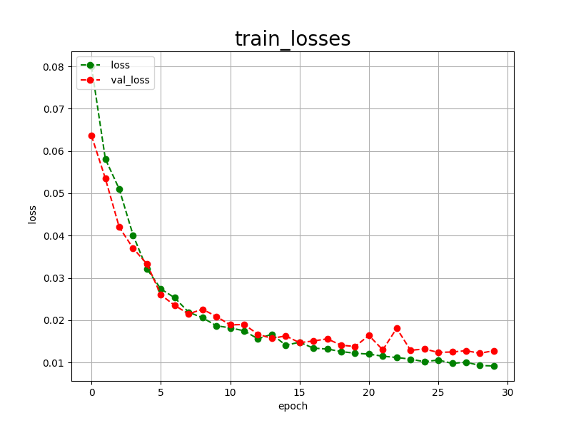 
 
<h3>
4 Evaluation
</h3>
Please move to <b>./projects/TensorFlowFlexUNet/ISPY1-Breast-Cancer</b> folder,
and run the following bat file to evaluate TensorFlowUNet model for ISPY1-Breast-Cancer. 
<pre>
>./2.evaluate.bat
</pre>
This bat file simply runs the following command.
<pre>
>python ../../../src/TensorFlowFlexUNetEvaluator.py ./train_eval_infer_aug.config
</pre>

Evaluation console output: 
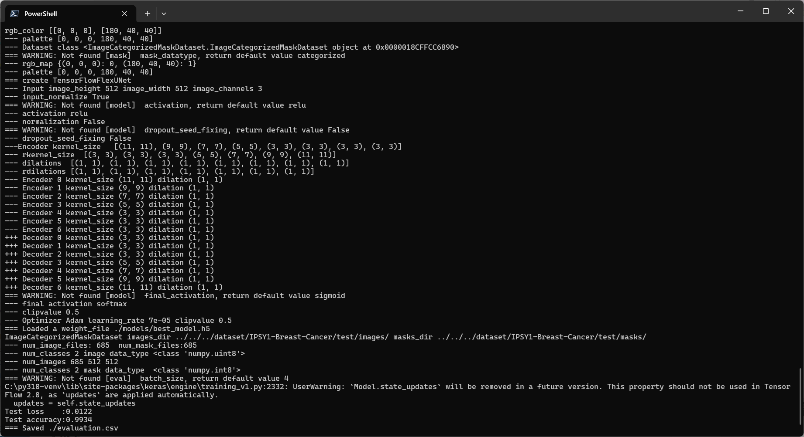
  Image-Segmentation-ISPY1-Breast-Cancer

<a href="./projects/TensorFlowFlexUNet/ISPY1-Breast-Cancer/evaluation.csv">evaluation.csv</a> 
The loss (categorical_crossentropy) to this <b>ISPY1-Breast-Cancer/test</b> was low and dice_coef_multiclass high as shown below.
 
<pre>
categorical_crossentropy,0.0122
dice_coef_multiclass,0.9934
</pre>
 
<h3>
5 Inference
</h3>
Please move to a <b>./projects/TensorFlowFlexUNet/ISPY1-Breast-Cancer</b> folder 
,and run the following bat file to infer segmentation regions for images by the Trained-TensorFlowUNet model for ISPY1-Breast-Cancer. 
<pre>
>./3.infer.bat
</pre>
This simply runs the following command.
<pre>
>python ../../../src/TensorFlowFlexUNetInferencer.py ./train_eval_infer_aug.config
</pre>

<b>mini_test_images</b> 
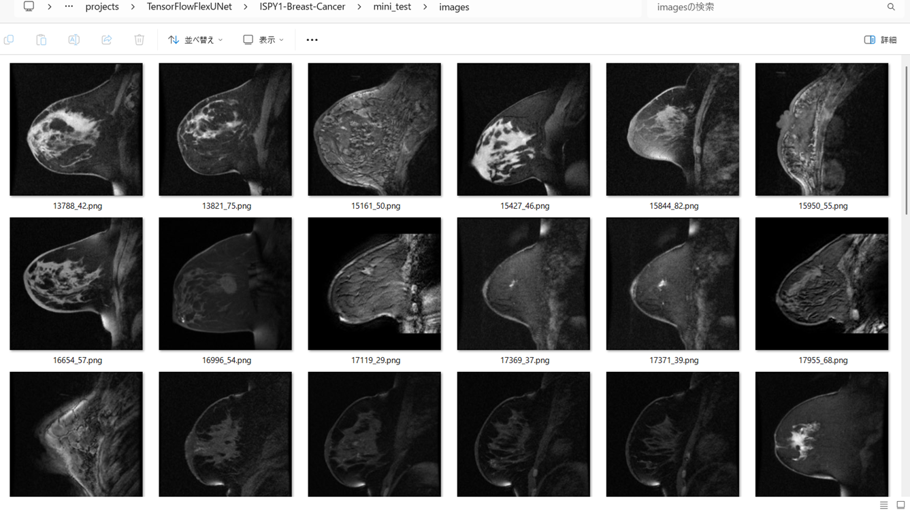 
<b>mini_test_mask(ground_truth)</b> 
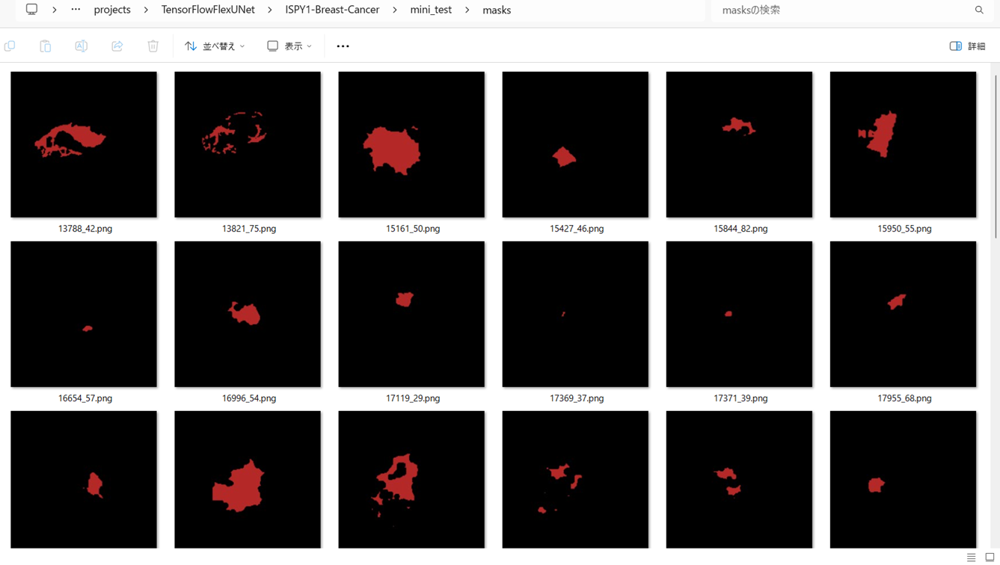 

<b>Inferred test masks</b> 
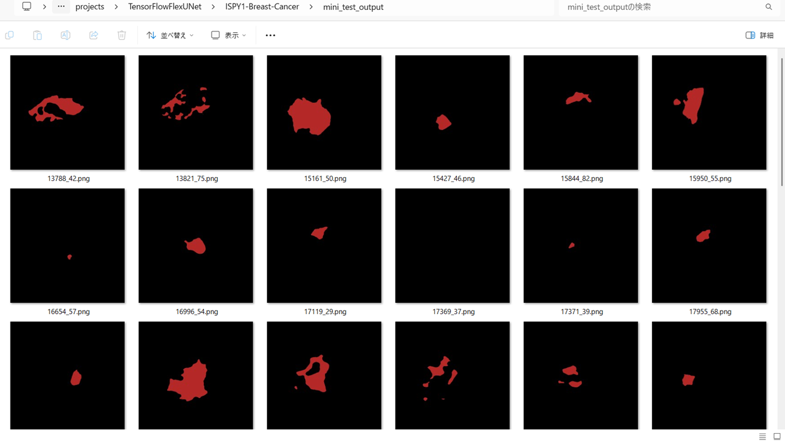 
 

<b>Enlarged images and masks of ISPY1-Breast-Cancer Images of 512x512 pixels</b> 
As shown below, the inferred masks predicted by our segmentation model trained by the dataset appear similar 
to the ground truth masks.
  
<b>class-color-map = {Cancer:dark red}</b>
  
<table>
<tr>
<th>Image</th>
<th>Mask (ground_truth)</th>
<th>Inferred-mask</th>
</tr>
<tr>
<td>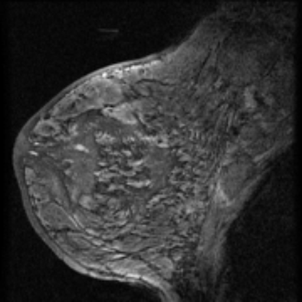</td>
<td></td>
<td></td>
</tr>

<tr>
<td>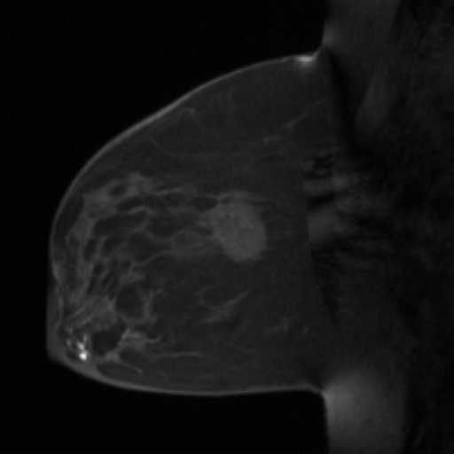</td>
<td></td>
<td></td>
</tr>

<tr>
<td></td>
<td></td>
<td></td>
</tr>

<tr>
<td>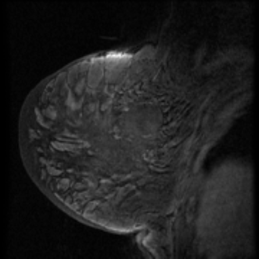</td>
<td></td>
<td></td>
</tr>

<tr>
<td>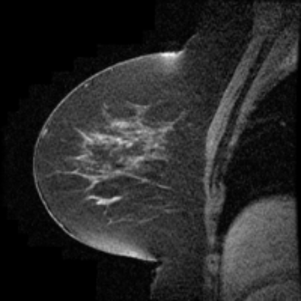</td>
<td></td>
<td></td>
</tr>

<tr>
<td>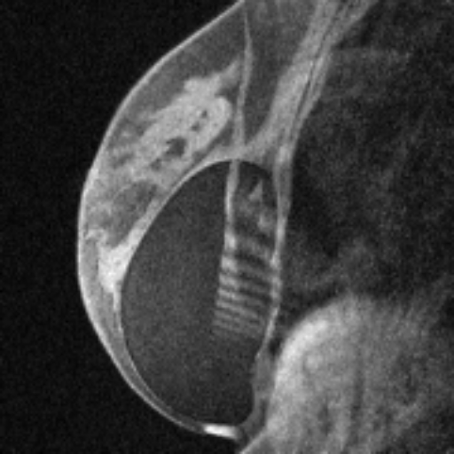</td>
<td></td>
<td></td>
</tr>
</table>

 
 
<h3>
6 3D Volume Inference
</h3>
Please move to <b>./projects/TensorFlowFlexUNet/ISPY1-Breast-Cancer</b> folder
,and run the following bat file to infer images segmentation for 2D slices of 3D volume NIfTI files
 by the Trained-TensorFlowFlexUNet model for ISPY1-Breast-Cancer. 
<pre>
>./5.infer3d.bat
</pre>
This simply runs the following command.
<pre>
>python ../../../src/TensorFlowFlexUNet3DInferencer.py ./train_eval_infer.config
</pre>
<b>infer3d section </b> in <a href="./projects/TensorFlowFlexUNet/ISPY1-Breast-Cancer/train_eval_infer.config">
train_eval_infer.config
<a></b>
<pre>
[infer3d] 
;Specify an images_dir which contains NIfTI or NPY files
images_dir    = "./mini_test_3d/images/"
output_dir    = "./mini_test_3d_output/"
slice_shape_order = "hwd"
slice_normalize = True
slice_resize   = (512,512)
slice_rotation = "cv2.ROTATE_90_COUNTERCLOCKWISE" 

mask_overlay  = True
</pre>

<b>Acutual Image Segmentation for 2D Slices of a ISPY1-Breast-Cancer NIfTI</b> 
Some Slices, Inferred Masks and Mask overlays for a 3D volume <b>ISPY1_1005_DCE_0000_N3_zscored.nii.gz</b> file in 
<b>ISPY1-Tumor-SEG-Radiomics/NIfTI-Files\images_bias-corrected_resampled_zscored_nifti/ISPY1_1005</b> folder. 
 
<b>class-color-map = {Cancer:dark red}</b>
 
<table>
<tr>
<th>Image</th>
<th>Inferred-mask</th>
<th>Mask overlay</th>
</tr>

<tr>
<td>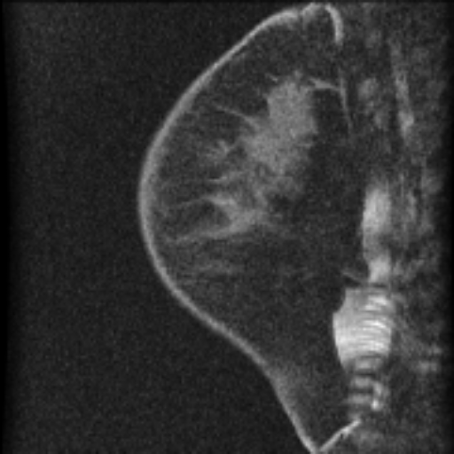</td>
<td></td>
<td>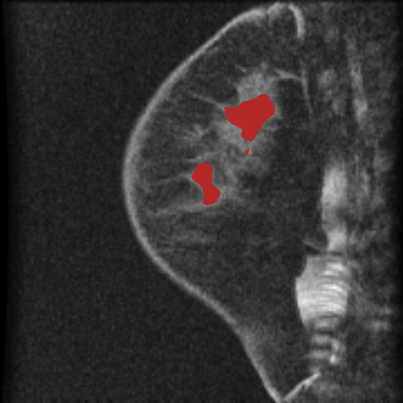</td>
</tr>

<tr>
<td>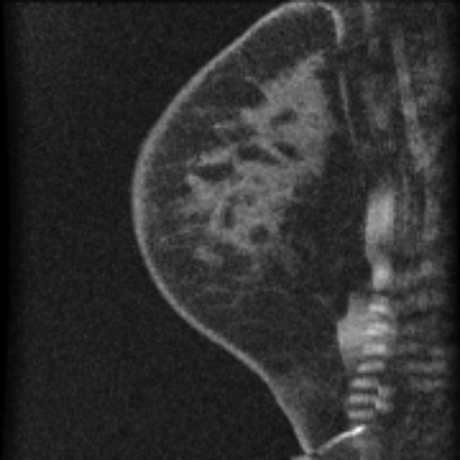</td>
<td></td>
<td>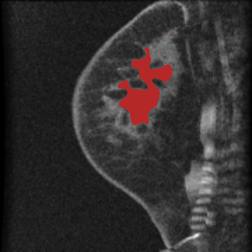</td>
</tr>
<tr>
<td>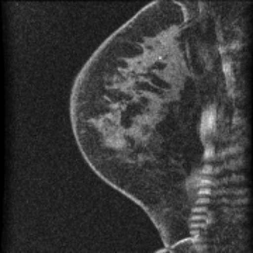</td>
<td></td>
<td>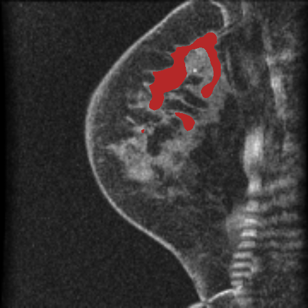</td>
</tr>
<tr>
<td>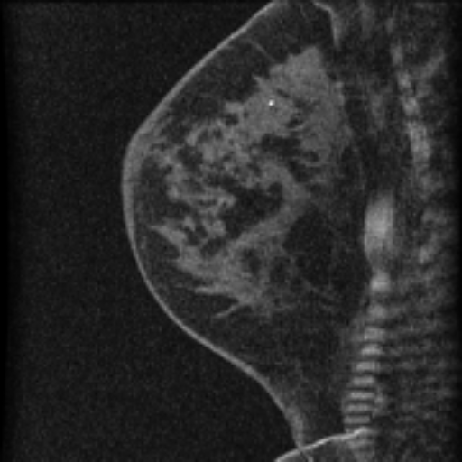</td>
<td></td>
<td>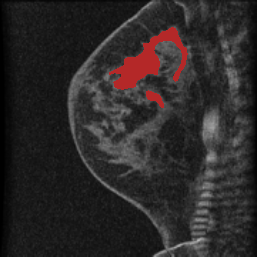</td>
</tr>
<tr>
<td>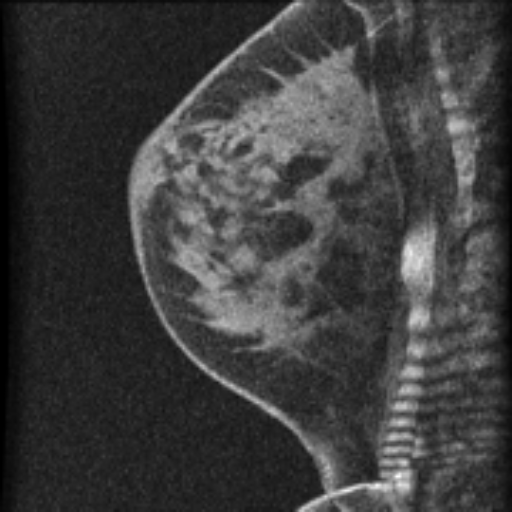</td>
<td></td>
<td>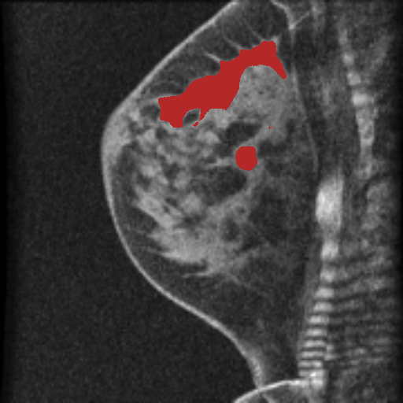</td>
</tr>
<tr>
<td>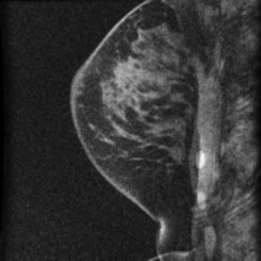</td>
<td></td>
<td>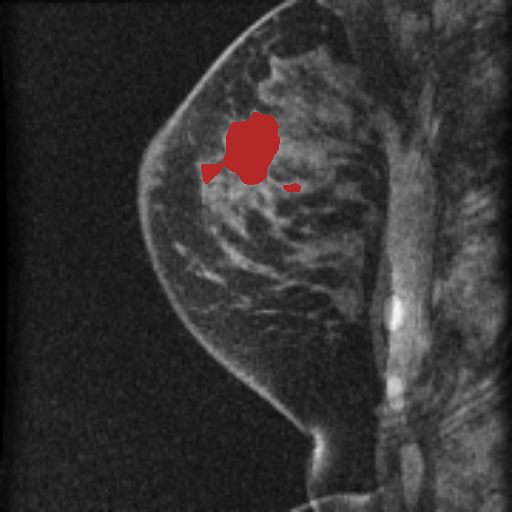</td>
</tr>

</table>

 
<h3>
7 MaskOverlay Video of 3D Volume Segmentation
</h3>
Please move to <b>./projects/TensorFlowFlexUNet/ISPY1-Breast-Cancer</b> folder, and run the following bat file 
to generate <b>overlays.mp4</b> or <b>overlay.gif</b> for MaskOverlays of 3D Volume Segmentation.  
<pre>
>./6.video3d.bat
</pre>
This simply runs the following command.
<pre>
>python ../../../src/MaskOverlayVideoGenerator.py ./train_eval_infer.config
</pre>
 
<b>infer3d section </b> in <a href="./projects/TensorFlowFlexUNet/ISPY1-Breast-Cancer/train_eval_infer.config">
train_eval_infer.config
<a></b>
<pre>
[infer3d] 
mask_overlay  = True
;Specify ".mp4" or ".gif".
;video_fileformat  = ".mp4"
video_fileformat  = ".gif"
</pre>
 
<b>overlays.gif</b> 

 
<h3>
References
</h3>
<b>1. TensorFlow-FlexUNet-Image-Segmentation-Breast-Ultrasound-Images</b> 
Toshiyuki Arai 
<a href="https://github.com/sarah-antillia/TensorFlow-FlexUNet-Image-Segmentation-Breast-Ultrasound-Images">
https://github.com/sarah-antillia/TensorFlow-FlexUNet-Image-Segmentation-Breast-Ultrasound-Images</a>
  

<b>2. TensorFlow-FlexUNet-Image-Segmentation-Breast-Lesions-USG</b> 
Toshiyuki Arai 
<a href="https://github.com/sarah-antillia/TensorFlow-FlexUNet-Image-Segmentation-Breast-Lesions-USG">
https://github.com/sarah-antillia/TensorFlow-FlexUNet-Image-Segmentation-Breast-Lesions-USG</a>
  
<b>3. TensorFlow-FlexUNet-Image-Segmentation-Model</b> 
Toshiyuki Arai 
<a href="https://github.com/sarah-antillia/TensorFlow-FlexUNet-Image-Segmentation-Model">
https://github.com/sarah-antillia/TensorFlow-FlexUNet-Image-Segmentation-Model</a>
  

